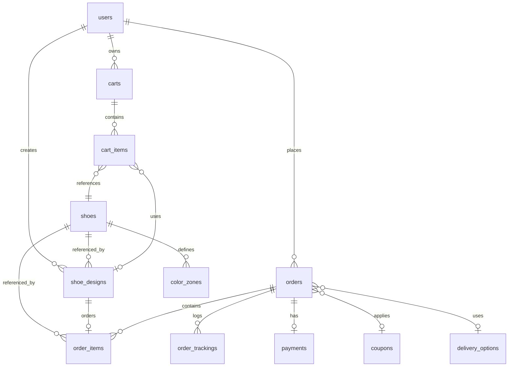

# 👟 UrbanLace — 3D Shoe Configurator & E-commerce Platform

UrbanLace is a modern, premium e-commerce platform and real-time **3D shoe configurator** built to provide customers with an immersive customization experience. Users can select shoe silhouettes (Low-top, Mid-top, High-top), customize individual mesh zones with specific colors and materials, save their designs, apply coupons, and track their order status through a handcrafted fulfillment pipeline.

---

## 🚀 Tech Stack

UrbanLace leverages a robust, modern technology stack to deliver seamless performance, clean code architecture, and high visual fidelity.

### Backend & Foundation
* **Framework:** [Laravel 11.x](https://laravel.com/) (PHP ^8.2) — offering elegant MVC routing, database migrations, model factories, and secure Eloquent ORM.
* **Authentication:** [Laravel Breeze](https://laravel.com/docs/11.x/breeze) — supplying production-ready, secure authentication templates, password updates, and profile management.
* **Document Generation:** `barryvdh/laravel-dompdf` — integrated for generating printable order receipts and invoices.
* **Database:** SQLite (default/development) / MySQL support.

### Frontend & Experience
* **Build Tooling:** [Vite 5.x](https://vitejs.dev/) with hot-reloading for ultra-fast compilation.
* **Styles:** [Tailwind CSS 3.x](https://tailwindcss.com/) — powering a fully custom, responsive design system.
* **3D Engine:** [Three.js (WebGL)](https://threejs.org/) — renders procedural 3D shoe models dynamically in the browser, complete with real-time shadow mapping and environment lighting.
* **State & Interaction:**
  * [Alpine.js](https://alpinejs.dev/) — handles lightweight, reactive view states and modal controls.
  * [GSAP (GreenSock)](https://greensock.com/gsap/) — powers smooth micro-animations, such as scale highlights when selecting mesh zones.
  * [Pickr](https://github.com/simonwep/pickr) — a professional, highly customizable inline color picker.
  * **Axios** — manages asynchronous API interactions for adding designs to carts, updating quantities, and applying coupons.

---

## ✨ Features

### 🎨 1. Real-time 3D Shoe Configurator
* **Multiple Silhouettes:** Customizes **Urban Classic Low**, **Urban Court Mid**, or **Urban Pro High**.
* **Precise Mesh Selection:** Selects individual zones by clicking on the list or interacting in the 3D space.
* **Realistic Materials:** Select from **Premium Leather**, **Suede**, **Mesh**, or **Canvas** — each with distinct physical properties (roughness and metalness values rendered dynamically by Three.js).
* **Color Customization:** Fine-tune hex values using an interactive color wheel (Pickr).
* **Design Saving:** Saves custom shoe designs to the user's dashboard with a snapshot of the custom configuration state.

### 🛒 2. Intelligent Shopping Cart
* **Guest & User Support:** Works seamlessly using Laravel sessions for guests and database persistence for logged-in users.
* **Dynamic Sizing:** Allows users to pick specific shoe sizes.
* **Material-based Upgrades:** Automatically adjusts pricing dynamically based on material modifiers (e.g. Premium Leather adds a higher price modifier).

### 🏷️ 3. Checkout & Coupon System
* **Multi-step Checkout:** Clean billing, shipping, and payment confirmation flows.
* **Dynamic Coupons:** Admin-configurable discount logic:
  * **Percentage Discounts** (e.g., 10% off).
  * **Fixed Value Discounts** (e.g., $15.00 off).
  * **Free Delivery Option**.
  * Supports validation constraints like expiry dates, minimum order values, and maximum utilization counts.
* **Flexible Delivery Options:** Customers can select standard shipping, express crafting, or rush orders with updated pricing.

### 📦 4. Order Tracking & Customer Dashboard
* **Saved Designs Library:** Displays saved configurations in the user dashboard, ready to be reviewed or ordered again.
* **Order Status Timeline:** Tracks orders visually through continuous states:
  `Pending` ➔ `Confirmed` ➔ `Crafting` ➔ `Quality Check` ➔ `Shipped` ➔ `Out for Delivery` ➔ `Delivered`

### 🛡️ 5. Admin Backoffice
* **Order Management Dashboard:** Allows administrators to view all purchases.
* **Status Updates:** Provides an admin control interface to advance customer orders through the crafting and delivery pipeline.

---

## 📊 Database Architecture

UrbanLace maintains clean relational structures. Below is a map of the core models and their relationships:



### Table Definitions & Roles
1. **`users`**: Customer and administrator accounts (`role` defines privileges).
2. **`shoes`**: Main product catalog containing base price, description, silhouette configurations (`low`, `mid`, `high`), and status.
3. **`color_zones`**: Customizable meshes for each shoe model mapping directly to Three.js identifiers (e.g., `vamp`, `swoosh`, `outsole`, `collar`).
4. **`materials`**: Material variants containing price modifiers (e.g. Leather adds $20) and physical attributes.
5. **`shoe_designs`**: Stores user-configured design states as JSON payloads (`design_json`).
6. **`carts` & `cart_items`**: Manages current shopping cart choices, size, quantity, and selected custom design configurations.
7. **`orders` & `order_items`**: Preserves snapshots of orders, including static snapshots of customized designs and purchase prices.
8. **`order_tracking`**: Logs historical timeline milestones for delivery verification.
9. **`coupons`**: Discount configurations including limits, expiry, types, and values.
10. **`delivery_options`**: Options like Standard, Express, or Rush with unique delivery fee schemes.

---

## 🛠️ Installation & Setup

Ensure you have **PHP >= 8.2**, **Composer**, and **Node.js** installed on your local machine.

### 1. Clone & Install Dependencies
```bash
# Clone the repository
git clone https://github.com/Vinayak-V/UrbanLace.git
cd UrbanLace

# Install PHP dependencies
composer install

# Install JS dependencies
npm install
```

### 2. Environment Configuration
Duplicate the example environment file and configure your database settings:
```bash
copy .env.example .env
```
*(By default, Laravel is preconfigured to use SQLite, which creates a local `database/database.sqlite` file. If using SQLite, make sure to create the database file.)*

Generate the application key:
```bash
php artisan key:generate
```

### 3. Database Migration & Seeding
Populate the database with default materials, shoe silhouettes, customizable zones, and shipping configurations:
```bash
php artisan migrate --seed
```

This creates two default users for easy local testing:
* **Admin Account:** `admin@urbanlace.com` (Password: `password`)
* **Customer Account:** `customer@urbanlace.com` (Password: `password`)

### 4. Build Assets & Start Development Server
Open two terminal windows to run the frontend build watcher and the local backend server simultaneously:

**Terminal 1 (Vite Dev Server):**
```bash
npm run dev
```

**Terminal 2 (Laravel Server):**
```bash
php artisan serve
```

Your app will be available at [http://127.0.0.1:8000](http://127.0.0.1:8000).

---

## 📂 Project Directory Map

* **`app/Http/Controllers/`**
  * `HomeController.php` — Directs to home page / catalogue spotlight.
  * `ProductController.php` — Visual catalogue and product description.
  * `ConfiguratorController.php` — Feeds configuration zone mappings, material prices, and saves custom JSON designs.
  * `CartController.php` — Manages dynamic session/database cart instances.
  * `CheckoutController.php` — Handles coupon applications and checkout order registration.
  * `DashboardController.php` — User portal for order tracking and saved design files.
  * `Admin/AdminController.php` — Admin backoffice controller.
* **`resources/js/configurator.js`** — Core Three.js runtime file initiating 3D geometry assemblies, light controls, orbital damping, color picker integration, and GSAP scale animations.
* **`resources/views/`**
  * `configurator/show.blade.php` — Interactive customizer workbench.
  * `layouts/` — Contains configurations layout structure.
  * `dashboard/` — User pages showing orders and design panels.
  * `admin/` — Admin panels for order processing.
* **`database/migrations/`** — Relational database structures.
* **`database/seeders/DatabaseSeeder.php`** — Seeds baseline shoes, pricing, materials, color zones, and shipping classes.
